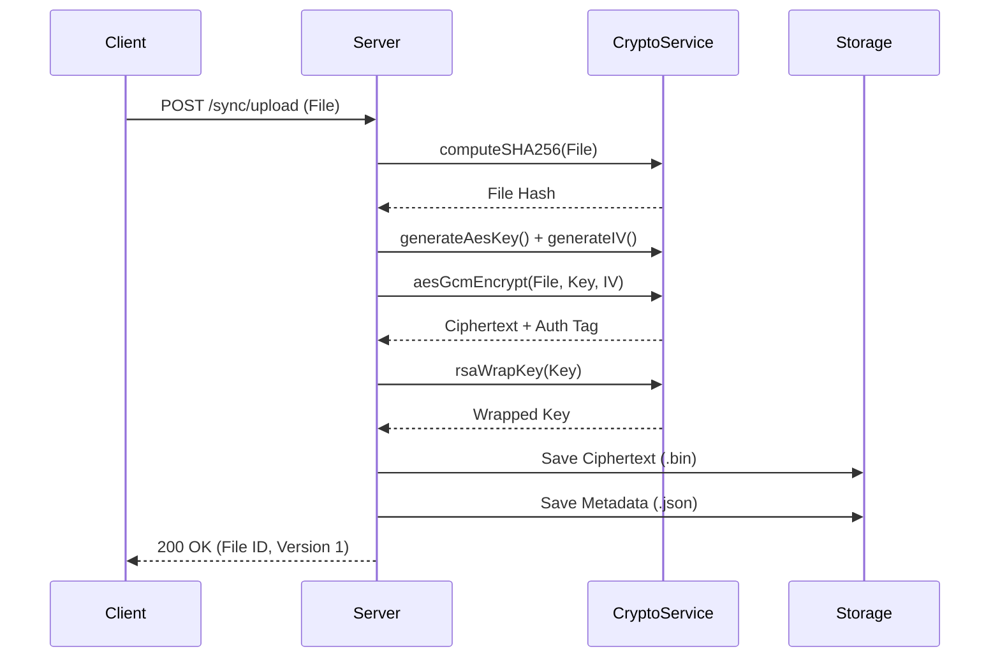
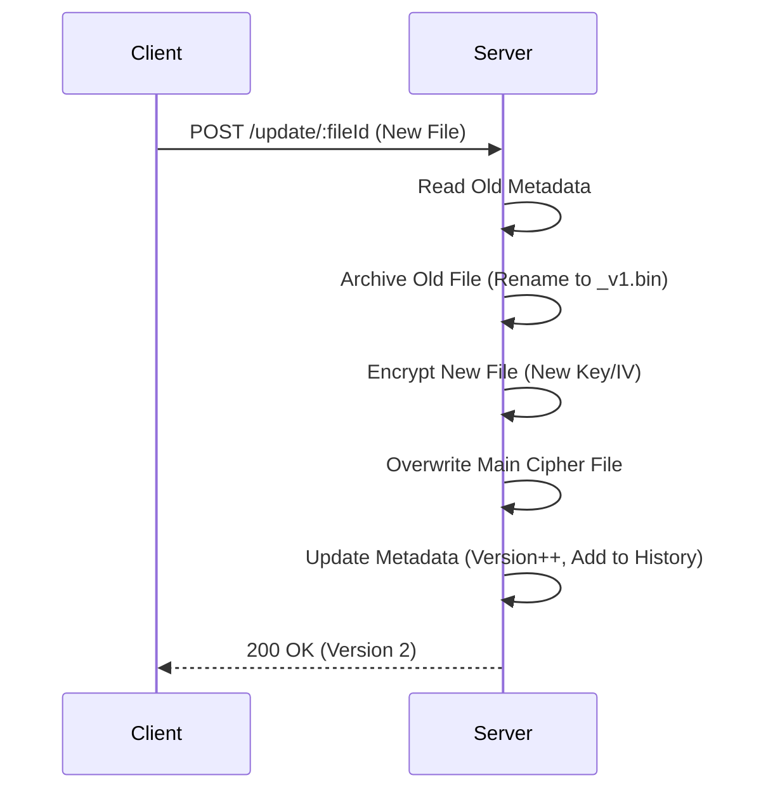
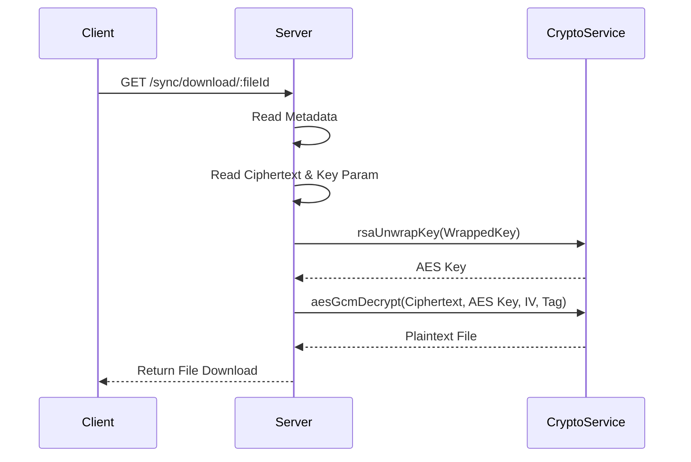

# System Architecture & Flowcharts - Secure Cloud Sync

## 1. System Architecture
The system follows a REST API architecture using Node.js (Express) with local storage for files and metadata.

```mermaid
graph TD
    User[User / Client] -- HTTP/JSON --> API[REST API Server (Node.js)]
    
    subgraph "Backend System"
        API -- "Auth & Validation" --> Controller[Route Controllers]
        
        Controller -- "Encrypt/Decrypt" --> Crypto[Crypto Service]
        Crypto -- "AES-256-GCM" --> AES[AES Engine]
        Crypto -- "RSA-2048" --> RSA[RSA Engine]
        
        Controller -- "Read/Write" --> Storage[Storage System]
        
        Storage -- "JSON" --> MetaDB[(Metadata Store)]
        Storage -- "Bin (Encrypted)" --> FileStore[(Cipher Storage)]
        Storage -- "PEM" --> KeyStore[(Key Storage)]
    end
```

## 2. Upload Process Flow (Encryption)


## 3. Update Process Flow (Versioning)


## 4. Download Process Flow (Decryption)

